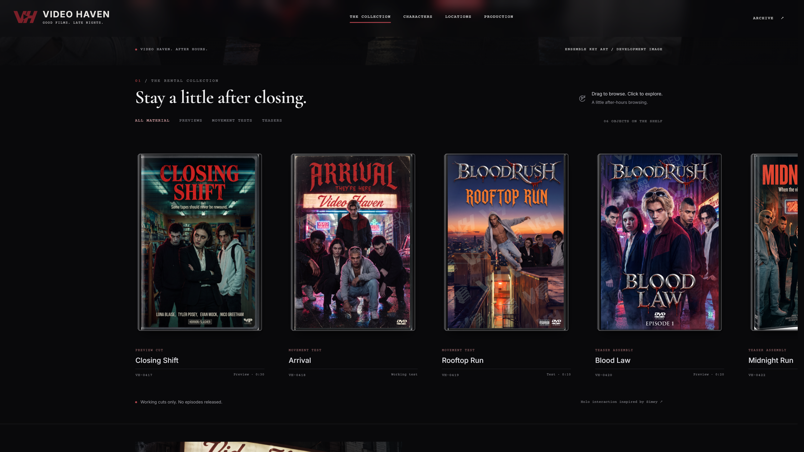

# Video Haven website brief



React 19, TypeScript, Vite, Tailwind, GSAP, and Three.js, managed with Bun. Vercel configuration builds the static site to dist; no deployment has been published.

```sh
bun install --frozen-lockfile
bun run dev
bun run build
bun run graft:build
```

Development runs at http://127.0.0.1:5174 with a strict port. Port 5173 is occupied by another app. The build includes TypeScript checking.

Graft 0.21.1 is a project development dependency. AGENTS.md holds its instructions; opencode.json configures MCP. Restart your coding agent to load the wiring. The generated graft/ folder stays local. On Windows, a missing Kotlin native parser can be rebuilt inside node_modules/tree-sitter-kotlin with `bunx node-gyp rebuild --python=<python.exe>`; Python and Visual Studio build tools are required.

Original media was imported from ../behind-the-cut/web/static/media, the existing Video Haven checkout. `bun run assets:import` refreshes the copies and verifies SHA-256 hashes. `references/video-haven-assets.json` records all 40 files. The original product brief is preserved in references/VIDEO-HAVEN-PRD.md.

Seven supplied DVD covers are stored unchanged in public/media/covers. `bun run covers:import` reimports them from Downloads (or a supplied directory). Titles, cover paths, and working footage are configured in src/data/content.ts; production artwork is configured in src/data/artwork.ts.

Episode cases and Midnight Run remain unreleased with no playable disc. Preview and test footage stays labeled as working material.
